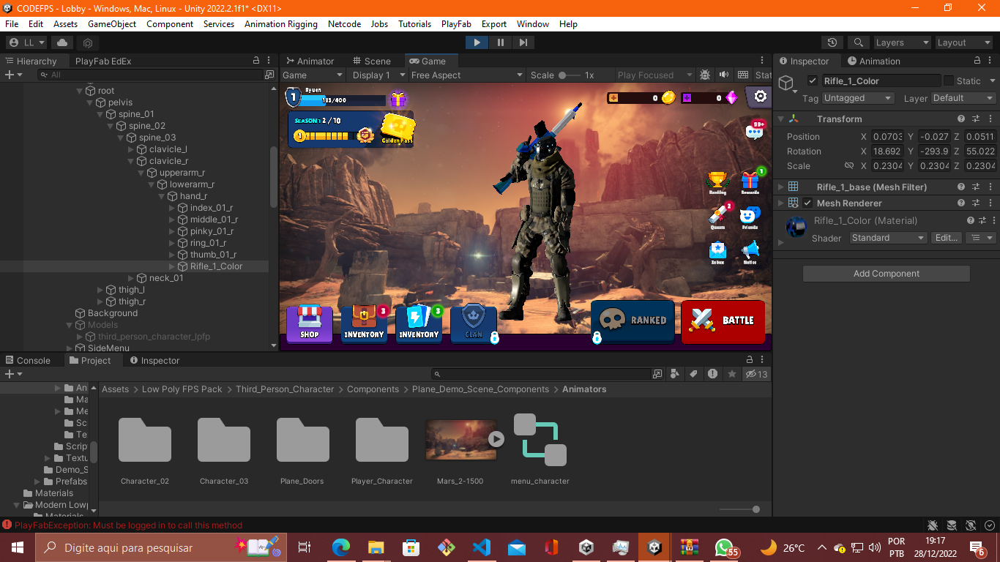
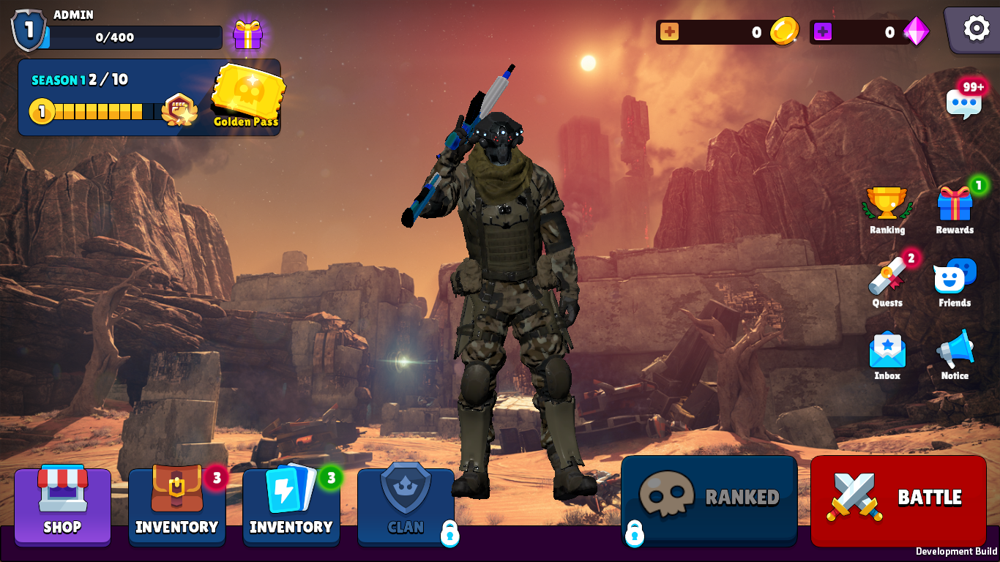
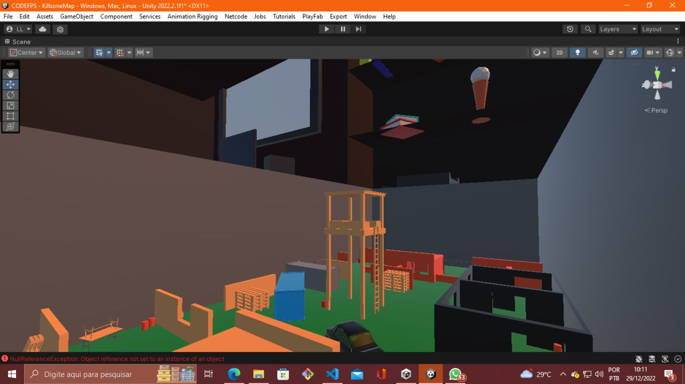

# Assault Fire

### Assault fire é um jogo que só eu estou desenvolvendo com alguns assets pagos e grátis de FPS para android pois já tenho conta de desenvolvedor no android. Ele está sendo feito na Unity em C#.

## Imagens da Tela Inicial

---------

### É possível criar e logar em sua conta com a integração do PlayFab da Microsoft, também é possível comprar itens, adicionar amigos, rank, comprar gemas etc.

-----

## Mapas

### Único mapa remodelado e testado é o KillZone de Brinquedo, que no caso é um mapa do jogo Call of Duty.

------

### Mais em breve, Projeto começado em 29/11/2022, Atualizado 13/12/2022.